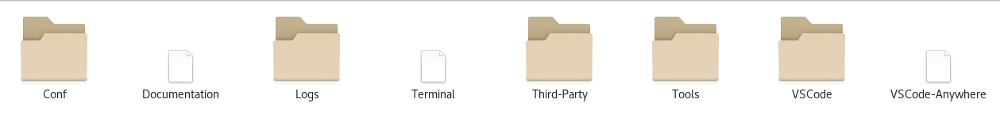
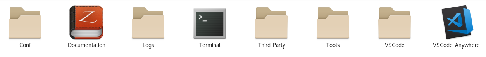
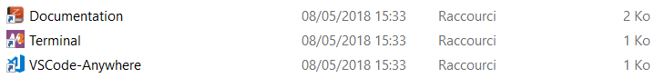

# VSCode-Anywhere

<!-- TOC -->

- [1. What is VSCode-Anywhere ?](#1-what-is-vscode-anywhere-)
- [2. Linux](#2-linux)
    - [2.1. Installation](#21-installation)
        - [2.1.1. Installation parameters](#211-installation-parameters)
        - [2.1.2. Installation process](#212-installation-process)
    - [2.2. Vars](#22-vars)
    - [2.3. Tools directory](#23-tools-directory)
        - [2.3.1. Install](#231-install)
        - [2.3.2. InstallFonts](#232-installfonts)
        - [2.3.3. Update](#233-update)
        - [2.3.4. Link](#234-link)
    - [2.4. Linux configuration file](#24-linux-configuration-file)
- [3. Windows](#3-windows)
    - [3.1. Installation](#31-installation)
        - [3.1.1. Installation parameters](#311-installation-parameters)
        - [3.1.2. Installation process](#312-installation-process)
    - [3.2. Vars](#32-vars)
    - [3.3. Tools directory](#33-tools-directory)
        - [3.3.1. Install](#331-install)
        - [3.3.2. InstallFonts](#332-installfonts)
        - [3.3.3. Update](#333-update)
        - [3.3.4. Link](#334-link)
    - [3.4. Windows configuration file](#34-windows-configuration-file)
- [4. Preconfigured extensions (from configuration file)](#4-preconfigured-extensions-from-configuration-file)
    - [4.1. zeal](#41-zeal)
    - [4.2. minimal](#42-minimal)
    - [4.3. general](#43-general)
    - [4.4. git](#44-git)
    - [4.5. theme](#45-theme)
    - [4.6. VSC-fonts](#46-vsc-fonts)
    - [4.7. tmux-gigix](#47-tmux-gigix)
    - [4.8. vim-gigix](#48-vim-gigix)
    - [4.9. python](#49-python)
    - [4.10. ruby](#410-ruby)
    - [4.11. perl](#411-perl)
    - [4.12. C/C++](#412-cc)
    - [4.13. C](#413-c)
    - [4.14. shell](#414-shell)
    - [4.15. go](#415-go)
    - [4.16. java](#416-java)
    - [4.17. php](#417-php)
    - [4.18. javascript](#418-javascript)
    - [4.19. css](#419-css)
    - [4.20. powershell](#420-powershell)
    - [4.21. docker](#421-docker)
    - [4.22. ansible](#422-ansible)
    - [4.23. puppet](#423-puppet)
    - [4.24. saltstack](#424-saltstack)
    - [4.25. markdown](#425-markdown)
    - [4.26. restructuredtext](#426-restructuredtext)

<!-- /TOC -->

## 1. What is VSCode-Anywhere ?

VSCode-Anywhere is based on [VSCode](https://code.visualstudio.com), a cross-platform software for development with :

- [IntelliSense](https://code.visualstudio.com/#meet-intellisense) for auto-complete your code
- [Debugging](https://code.visualstudio.com/#powerful-debugging) for debug your code with break points, call stacks, and an interactive console
- [Git](https://code.visualstudio.com/#built-in-git) if you want to manage your code with git
- [Extensions](https://code.visualstudio.com/#hundreds-of-extensions) for add new languages, themes, debuggers, and to connect to additional services

**_VSCode-Anywhere_** is a portable software. This means that you can use this tool anywhere (with an USB key for example) without privileges (you don't need **Administrator** account on Windows or **root** on Linux). The only thing you need for [installation](#312-process) is Internet (Internet is also needed if you want to [install](#331-install) new components or [update](#333-update) components already installed).

VSCode-Anywhere is preconfigured with features, you can modify or add your own features in the configuration file.

With traditionnal VSCode,for example if you want to developped in _Python_ language, you must to have Python installed with some Python modules like **flake8**. With VSCode-Anywhere you have just to enabled Python section in the configuration file and start the installation process.

VSCode-Anywhere install for you (if *zeal_enabled* is set to _true_) the documentation of your language (with Zeal software). Always with Python example, Python2 and Python3 documentation will be downloaded add you will have access to this documentation accross your code.

Dependancies (like Python, modules and documentation) will be installed with :

- [Junest](https://github.com/fsquillace/junest) (only on Linux)
- [MSYS2](https://www.msys2.org) (only on Windows)
- [Zeal](https://zealdocs.org)

## 2. Linux

### 2.1. Installation

#### 2.1.1. Installation parameters

Install parameters :

- **-path** : installation directory (folder _VSCode-Anywhere_ will be automatically created in this directory)
- **-conf** : specify the configuration file path

#### 2.1.2. Installation process

**Requirements :**

- bash
- wget
- tput
- tar

There are 3 configuration files available with all the same features configured but not the same features enabled :

- [VSCode-Anywhere_minimal.conf](Windows/VSCode-Anywhere_minimal.conf) : install VSCode-Anywhere with the minimal features (Zeal is disabled). Only Junest and VSCode (without extension) will be installed
- [VSCode-Anywhere_recommended.conf](Windows/VSCode-Anywhere_recommended.conf) : install VSCode-Anywhere with the recommended components. Junest (configured with tmux-gigix, vim-gigix), Git, Zeal and VSCode (with theme, icons pack, fonts, and some extensions present in general section) will be installed. This is the recommended initial setup
- [VSCode-Anywhere_full.conf](Windows/VSCode-Anywhere_full.conf) : install VSCode-Anywhere with all sections enabled in the configuration file. Install can take a long time

Install with bash (paste the following line on your terminal) :

```bash
mkdir -p /tmp/VSCode-Anywhere && wget -q https://raw.githubusercontent.com/gigi206/VSCode-Anywhere/master/Linux/install.sh -O /tmp/VSCode-Anywhere/VSCode-Anywhere.sh && wget -q https://raw.githubusercontent.com/gigi206/VSCode-Anywhere/master/Linux/VSCode-Anywhere_recommended.conf -O /tmp/VSCode-Anywhere/VSCode-Anywhere.conf && cd /tmp/VSCode-Anywhere && chmod +x VSCode-Anywhere.sh && ./VSCode-Anywhere.sh --path "/MyPATH" && cd - && rm -fr /tmp/VSCode-Anywhere
```

**NOTE :**

- Replace _**/MyPATH**_ by your installation path
- Also you can choose one of these preconfigured profiles : _**VSCode-Anywhere_minimal.conf**_, _**VSCode-Anywhere_recommended.conf**_ or _**VSCode-Anywhere_full.conf**_
- After installation you can edit configuration file _**VSCode-Anywhere\Conf\VSCode-Anywhere.conf**_ and install your own settings with run _**[VSCode-Anywhere\Tools\Install](#331-install)**_.
- Full installation (with all sections enabled) used average 7 Go data space on your device (270 000 files with 37 000 folders)
- Installation can take a long time depending on your Internet connection speed and the IO performance of your device

VSCode-Anywhere will install and upgrade MSYS2. During the upgade of MSYS2, the window must to be closed for continue the installation :


### 2.2. Vars

Vars can be used in the config files for functions : **cmd_pre**, **vsc_settings**, **cmd_post**, **cmd_update**, **msys2_env** and **vsc_env**

Vars :

- __$ProgramName :__ program name (_VSCode-Anywhere_)
- __$InstallDir :__ path to your install directory (_${ProgramName}_)
- __$ConfDir :__ config directory (_${InstallDir}/Conf_)
- __$ProgramConfig :__ path to the config file (_${ConDir}/${ProgramName}.conf_)
- __$LogDir :__ path to log directory (_${InstallDir}/Logs_)
- __$Log :__ log file : _${LogDir}\install.log_ for installation, _${LogDir}/update.log_ for update, _${LogDir}/fonts.log_ font installation fonts or _${LogDir}/link.log_ when you relink
- __$ThirdParty :__ path to Third-Party directory (_${InstallDir}/Third-Party_)
- __$FontsDir :__ path to fonts directory (_${ThirdParty}/Fonts_)
- __$ToolsDir :__ path to Tools directory (_${InstallDir}/Tools_)
- __$VSCAppName :__ VSCode name (_VSCode_)
- __$VSCAppPath :__ path to VSCode directory (_${InstallDir}/${VSCAppName}_)
- __$VSCAppPath_install :__ path to VSCode install directory (_${VSCAppPath}/install_)
- __$VSCAppPath_extensions :__ path to VSCode extensions directory (_${VSCAppPath}/extensions_)
- __$VSCAppPath_user_data :__ path to VSCode user dara (_${VSCAppPath}/user-data_)
- __$JunestAppNameJunest :__ Junest name (_Junest_)
- __$JunestAppPath :__ path to Junest directory (_${ThirdParty}/JunestAppName_)
- __$JunestAppPath_install :__ path to Junest install directory (_${JunestAppPath}/install_)
- __$JunestAppPath_chroot :__ path to chrooted system (_${JunestAppPath}/chroot_)
- __$JunestAppPath_bin :__ path to Junest binary (_${JunestAppPath_install}/bin/junest_)
- __$JunestExternalPath :__ path is __/__ when *__JunestCmd__* is called or installation path when you are inside VSCode (_/${ProgramName}_)"
- __$ZealAppName :__ Zeal name (_Zeal_)
- __$ZealAppPath :__ = path to Zeal directory (_${ThirdParty}/${ZealAppName}_)
- __$ZealAppPath_install :__ path to Zeal install directory (_${ZealAppPath}/install_)
- __$ZealAppPath_bin :__ path to Zeal install directory (_${ZealAppPath_install}/zeal.exe_)
- __$ZealAppPath_docsets :__ path to Zeal docsets directory (_${ZealAppPath_install}/docsets_)

### 2.3. Tools directory

#### 2.3.1. Install

In directory Tools, run _**Install**_ for install new components from configuration file (if you have changed a section **enabled** from **false** to **true**).

**NOTE :** Set **enabled** from **true** to **false** don't uninstall plugins/settings (section just be ignored) !

#### 2.3.2. InstallFonts

In directory Tools, run **InstallFonts** for example if you use an USB device and you change computer. If needed fonts are not installed on the computer, you can install them by clicking on **InstallFonts**.

**NOTE :** fonts are stored in _Third-Party/Fonts_ directory (_${FontsDir}_)

#### 2.3.3. Update

In directory Tools, run **Update** to :

- execute **junest_cmd_update** and **cmd_update** functions (Junest will be also updated by this way)
- update VSCode
- update Zeal and its documentation (if Zeal is enabled inconfiguration file)

**NOTE :** **junest_cmd_update** and **cmd_update** are not run with **Install**

#### 2.3.4. Link

In directory Tools, run **Link.sh** if you move your installation directory, or you use an USB device and you plug-in on another computer with a different path. In this case you need to relink by executing this script.

The simple way to know if you need to relink is that you will not see icons in _**VSCode-Anywhere**_ (installation directory). **Terminal**, **VSCode-Anywhere** and **Documentation** will be white instead of displaying theirs icons.



You don't need to relink if you see icons :



### 2.4. Linux configuration file

Configuration file is written in [json](https://www.json.org) format.

The configuration file is devided in two main parts :

- base :
  - **proxy** _type string_ : (not tested yet)
    - **url** _type string_ : proxy url
    - **login** _type string_ : login for the proxy
    - **password** _type string_ : password for the proxy
  - **junest_terminal_opts** _type string_ : optionsuse by Junest when youstart the terminal
  - **zeal_enabled** _type bool_ : enable or disable Zeal (for install and download documentation)
  - **zeal_url** _type string_ : url to download Zeal from a specific url (keep null value to download the latest version)
- extensions :
  - **enabled** _type bool_ : enable or disable the extension
  - **cmd_pre** _type array_ : run powershell command
  - **junest_cmd_pre** _type array_ : run shell Junest command
  - **junest_pkg** _type array_ : install Junest packages
  - **vsc_pkg** _type array_ : install VSCode plugins
  - **vsc_settings** _type object_ : add VSCode settings
  - **vsc_keyboard** _type array containing objects_ : add VScode keyboard shortcuts
  - **junest_cmd_post** _type array_ : run shell Junest command
  - **cmd_post** _type array_ : run powershell command
  - **junest_cmd_update** _type array_ : run shell Junest command (executed only with update command)
  - **cmd_update** _type array_ : run powershell command (executed only with update command)
  - **zeal_pkg** _type array containing objects_ : name used for the docset (see <https://github.com/Kapeli/feeds> or <https://github.com/Kapeli/Dash-User-Contributions/tree/master/docsets>)
  - **junest_env** _type object_ : environment use for run shell Junest command  (use also for run terminal mintty)
  - **vsc_env** _type object_ : environment use for run PowerShell command (use also for launch VSCode)

You can use **null** value to disable one of these functions.

Installation execution order if enabled (not **null**) :
_**cmd_pre**_ > _**junest_cmd_pre**_ > _**junest_pkg**_ > _**vsc_pkg**_ > _**vsc_settings**_ > _**vsc_keyboard**_ > _**zeal_pkg**_ > _**junest_cmd_post**_ > _**cmd_post**_

## 3. Windows

### 3.1. Installation

#### 3.1.1. Installation parameters

Install parameters :

- **-path** : installation directory (folder _VSCode-Anywhere_ will be automatically created in this directory)
- **-conf** : specify the configuration file path

#### 3.1.2. Installation process

**Requirements :**

- PowerShell
- your device must be format with NTFS filesystem

There are 3 configuration files available with all the same features configured but not the same features enabled :

- [VSCode-Anywhere_minimal.conf](Windows/VSCode-Anywhere_minimal.conf) : install VSCode-Anywhere with the minimal features (Zeal is disabled). Only MSYS2, Git and VSCode (without extension) will be installed
- [VSCode-Anywhere_recommended.conf](Windows/VSCode-Anywhere_recommended.conf) : install VSCode-Anywhere with the recommended components. MSYS2 (configured with tmux-gigix, vim-gigix), Git, Zeal and VSCode (with theme, icons pack, fonts, and some extensions present in general section) will be installed. This is the recommended initial setup
- [VSCode-Anywhere_full.conf](Windows/VSCode-Anywhere_full.conf) : install VSCode-Anywhere with all sections enabled in the configuration file. Install can take a long time

Install with **cmd.exe** :

```bat
powershell -Command "Invoke-WebRequest -Uri https://raw.githubusercontent.com/gigi206/VSCode-Anywhere/master/Windows/VSCode-Anywhere_recommended.conf -OutFile VSCode-Anywhere.conf"; powershell -Command "Invoke-WebRequest -Uri https://raw.githubusercontent.com/gigi206/VSCode-Anywhere/master/Windows/install.ps1 -OutFile install.ps1"; powershell -NoProfile -InputFormat None -ExecutionPolicy Bypass -File install.ps1 -path "C:\MyPATH"; Remove-Item -Force install.ps1, VSCode-Anywhere.conf
```

[](https://www.youtube.com/watch?v=A4HhkL78OVQ)

**NOTE :**

- Replace _**C:\MyPATH**_ by your installation path
- Also you can choose one of these preconfigured profiles : _**VSCode-Anywhere_minimal.conf**_, _**VSCode-Anywhere_recommended.conf**_ or _**VSCode-Anywhere_full.conf**_
- After installation you can edit configuration file _**VSCode-Anywhere\Conf\VSCode-Anywhere.conf**_ and install your own settings with run _**[VSCode-Anywhere\Tools\Install](#331-install)**_.
- Full installation (with all sections enabled) used average 7 Go data space on your device (270 000 files with 37 000 folders)
- Installation can take a long time depending on your Internet connection speed and the IO performance of your device

VSCode-Anywhere will install and upgrade MSYS2. During the upgade of MSYS2, the window must to be closed for continue the installation :


### 3.2. Vars

Vars can be used in the config files for functions : **cmd_pre**, **vsc_settings**, **cmd_post**, **cmd_update**, **msys2_env** and **vsc_env**

Vars :

- __$ProgramName :__ program name (_VSCode-Anywhere_)
- __$InstallDir :__ path to your install directory (_$ProgramName_)
- __$ConfDir :__ config directory (_$InstallDir\Conf_)
- __$ProgramConfig :__ path to the config file (_$ConDir\${ProgramName}.conf_)
- __$LogDir :__ path to log directory (_$InstallDir\Logs_)
- __$log :__ log file : _$LogDir\install.log_ for installation or _$LogDir\update.log_ for update
- __$ThirdParty :__ path to Third-Party directory (_$InstallDir\Third-Party_)
- __$FontsDir :__ path to fonts directory (_$ThirdParty\Fonts_)
- __$ToolsDir :__ path to Tools directory (_$InstallDir\Tools_)
- __$VSCAppName :__ VSCode name (_VSCode_)
- __$VSCAppPath :__ path to VSCode directory (_$InstallDir\$VSCAppName_)
- __$VSCAppPath_install :__ path to VSCode install directory (_$VSCAppPath\install_)
- __$VSCAppPath_extensions :__ path to VSCode extensions directory (_$VSCAppPath\extensions_)
- __$VSCAppPath_user_data :__ path to VSCode user dara (_$VSCAppPath\user-data_)
- __$MSYS2AppName :__ MSYS2 name (_MSYS2_)
- __$MSYS2AppPath :__ path to MSYS2 directory (_$ThirdParty\$MSYS2AppName_)
- __$MSYS2AppPath_install :__ path to MSYS2 install directory (_$MSYS2AppPath\install_)
- __$7zAppName :__ 7-zip name (_7-zip_)
- __$7zAppPath :__ path to 7-zip directory (_$ThirdParty\$7zAppName_)
- __$7zAppPath_install :__ path to 7-zip install directory (_$7zAppPath\install_)
- __$7zAppPath_bin :__ path to 7-zip install directory (_$7zAppPath_install\7za.exe_)
- __$ZealAppName :__ Zeal name (_Zeal_)
- __$ZealAppPath :__ = path to Zeal directory (_$ThirdParty\$ZealAppName_)
- __$ZealAppPath_install :__ path to Zeal install directory (_$ZealAppPath\install_)
- __$ZealAppPath_bin :__ path to Zeal install directory (_$ZealAppPath_install\zeal.exe_)
- __$ZealAppPath_docsets :__ path to Zeal docsets directory (_$ZealAppPath_install\docsets_)
- __$config :__ config file values (_object_)

### 3.3. Tools directory

#### 3.3.1. Install

In directory Tools, run _**Install**_ for install new components from configuration file (if you have changed a section **enabled** from **false** to **true**).

**NOTE :** Set **enabled** from **true** to **false** don't uninstall plugins/settings (section just be ignored) !

[](https://www.youtube.com/watch?v=9Rpxrar_VbU)

#### 3.3.2. InstallFonts

In directory Tools, run **InstallFonts** for example if you use an USB device and you change computer. If needed fonts are not installed on the computer, you can install them by clicking on **InstallFonts**.

**NOTE :** fonts are stored in _Third-Party\Fonts_ directory (_$FontsDir_)

[](https://www.youtube.com/watch?v=XXmzSDbJZg8)

#### 3.3.3. Update

In directory Tools, run **Update** to :

- execute **msys2_cmd_update** and **cmd_update** functions (MSYS2 will be also updated by this way)
- update VSCode and 7-zip software
- update Zeal and its documentation (if Zeal is enabled inconfiguration file)

**NOTE :** **msys2_cmd_update** and **cmd_update** are not run with **Install**

[](https://www.youtube.com/watch?v=kR-Y7XFzoaE)

#### 3.3.4. Link

In directory Tools, run **Link.cmd** if you move your installation directory, or you use an USB device and you plug-in on another computer with a different access letter. In this case you need to relink by executing this script.

The simple way to know if you need to relink is that you will not see icons in _**VSCode-Anywhere**_ (installation directory). **Terminal**, **VSCode-Anywhere** and **Documentation** will be white instead of displaying theirs icons.


You don't need to relink if you see icons :



[](https://www.youtube.com/watch?v=QkMH1DHlaCM)

### 3.4. Windows configuration file

Configuration file is written in [json](https://www.json.org) format.

The configuration file is devided in two main parts :

- base :
  - **proxy** _type string_ : (not tested yet)
    - **url** _type string_ : proxy url
    - **login** _type string_ : login for the proxy
    - **password** _type string_ : password for the proxy
  - **vsc_url** _type string_ : url to download VSCode, for example <https://az764295.vo.msecnd.net/stable/3aeede733d9a3098f7b4bdc1f66b63b0f48c1ef9/VSCode-win32-x64-1.22.2.zip> (keep null value to automatically download the latest version)
  - **msys2_url** _type string_ : url to download MSYS2, for example <http://repo.msys2.org/distrib/x86_64/msys2-base-x86_64-20161025.tar.xz> (keep null value to automatically download the latest version)
  - **zip_url** _type string_ : url to download 7-zip from a zip version (7za920.zip is the last version in zip format and it is used to extract new version in .7z format)
  - **msys2_opts** _type array_ : options for [mintty](https://mintty.github.io/) console
  - **zeal_enabled** _type bool_ : enable or disable Zeal (for install and download documentation)
  - **zeal_url** _type string_ : url to download Zeal from a specific url (keep null value to download the latest version)
- extensions :
  - **enabled** _type bool_ : enable or disable the extension
  - **cmd_pre** _type array_ : run powershell command
  - **msys2_cmd_pre** _type array_ : run shell MSYS2 command
  - **msys2_pkg** _type array_ : install MSYS2 packages
  - **vsc_pkg** _type array_ : install VSCode plugins
  - **vsc_settings** _type object_ : add VSCode settings
  - **vsc_keyboard** _type array containing objects_ : add VScode keyboard shortcuts
  - **msys2_cmd_post** _type array_ : run shell MSYS2 command
  - **cmd_post** _type array_ : run powershell command
  - **msys2_cmd_update** _type array_ : run shell MSYS2 command (executed only with update command)
  - **cmd_update** _type array_ : run powershell command (executed only with update command)
  - **zeal_pkg** _type array containing objects_ : name used for the docset (see <https://github.com/Kapeli/feeds> or <https://github.com/Kapeli/Dash-User-Contributions/tree/master/docsets>)
  - **msys2_env** _type object_ : environment use for run shell MSYS2 command  (use also for run terminal mintty)
  - **vsc_env** _type object_ : environment use for run PowerShell command (use also for launch VSCode)

You can use **null** value to disable one of these functions.

Installation execution order if enabled  (not **null**) :
_**cmd_pre**_ > _**msys2_cmd_pre**_ > _**msys2_pkg**_ > _**vsc_pkg**_ > _**vsc_settings**_ > _**vsc_keyboard**_ > _**zeal_pkg**_ > _**msys2_cmd_post**_ > _**cmd_post**_

## 4. Preconfigured extensions (from configuration file)

### 4.1. zeal

**Note :** [Dash](https://marketplace.visualstudio.com/items?itemName=deerawan.vscode-dash) extension will be automatically installed if _zeal_enabled_ settings is set to _true_.


### 4.2. minimal

**minimal** is the minimal for running VSCode-Anywhere

**Important :** It is recommanded to keep this extension enabled

**NOTE :** for compatibility reasons we use [official git](https://git-scm.com/download/win). MSYS2 git package seems to have problems with some VSCode extensions

### 4.3. general

Add some VSCode extensions :

- [Bookmarks](https://marketplace.visualstudio.com/items?itemName=alefragnani.Bookmarks)


- [Project Manager](https://marketplace.visualstudio.com/items?itemName=alefragnani.project-manager)


- [Path Autocomplete](https://marketplace.visualstudio.com/items?itemName=christian-kohler.path-intellisense)


- [Bracket Pair Colorizer](https://marketplace.visualstudio.com/items?itemName=CoenraadS.bracket-pair-colorizer)


- [Code Runner](https://marketplace.visualstudio.com/items?itemName=formulahendry.code-runner)


- [Guides](https://marketplace.visualstudio.com/items?itemName=spywhere.guides)


- [Highlight Trailing White Spaces](https://marketplace.visualstudio.com/items?itemName=ybaumes.highlight-trailing-white-spaces)


- [Code Outline](https://marketplace.visualstudio.com/items?itemName=patrys.vscode-code-outline)

These extensions add some basic features to VSCode and we recommend to keep enabled this section.

### 4.4. git

Add extensions for Git :

- [Git History](https://marketplace.visualstudio.com/items?itemName=donjayamanne.githistory)


- [GitLens — Git supercharged](https://marketplace.visualstudio.com/items?itemName=eamodio.gitlens)


- [Ungit](https://marketplace.visualstudio.com/items?itemName=Hirse.vscode-ungit)


### 4.5. theme

Add icons pack and themes :

- [OneDark++](https://marketplace.visualstudio.com/items?itemName=ifaxity.onedark)
- [Atom One Dark Theme](https://marketplace.visualstudio.com/items?itemName=akamud.vscode-theme-onedark)


- [vscode-icons](https://marketplace.visualstudio.com/items?itemName=robertohuertasm.vscode-icons)


### 4.6. VSC-fonts

Install and configure ligatures [Fira Code](https://github.com/tonsky/FiraCode) fonts in VSCode.

### 4.7. tmux-gigix

Configure [mintty](https://mintty.github.io/) console with [tmux-gigix](https://github.com/gigi206/tmux-gigix).

Screenshot with tmux-gigix + vim-gigix enabled :


### 4.8. vim-gigix

Install and configure [vim-gigix](https://github.com/gigi206/vim-gigix).

### 4.9. python

Configure environment for [Python2/3](https://www.python.org) languages.

VSCode Extensions :

- [Python](https://marketplace.visualstudio.com/items?itemName=ms-python.python)

Please read these [instructions](https://code.visualstudio.com/docs/languages/python)


### 4.10. ruby

Configure environment for [ruby](https://www.ruby-lang.org) language.

VSCode extensions :

- [Ruby](https://marketplace.visualstudio.com/items?itemName=rebornix.Ruby)
- [Ruby Solargraph](https://marketplace.visualstudio.com/items?itemName=castwide.solargraph)


Please see [this issue](https://github.com/castwide/vscode-solargraph/issues/55) if completion doesn't work.

### 4.11. perl

Configure environment for [Perl](https://www.perl.org) language.

VSCode extensions :

- [Perl](https://marketplace.visualstudio.com/items?itemName=henriiik.vscode-perl)
- [Perl Debug](https://marketplace.visualstudio.com/items?itemName=mortenhenriksen.perl-debug)


### 4.12. C/C++

Configure environment for [C/C++](https://isocpp.org) language.

VSCode extensions :

- [C/C++](https://marketplace.visualstudio.com/items?itemName=ms-vscode.cpptools)

Please read these [instructions](https://code.visualstudio.com/docs/languages/cpp).


**NOTE :** There is an issue with this extension on Windows (not Linux). This problem is resolved in the configuration file within function _cmd_post_ that copy file _msvc.64.linux.json_ to _msvc.64.intel.json_ in bin directory of this extension plugin. If this extension is updated you need to launch [Install](#331-install) or copy manually the file !

**Configuration :** example for minimal configuration settings for _c_cpp_properties.json_file in _Win32_ section. In this example _D:/VSCode-Anywhere_ in my install path on my usb device (replace _D:/_ by your path) :

```json
{
    "configurations": [
        {
            "name": "Win32",
            "browse": {
                "path": [
                    "${workspaceFolder}",
                    "D:/VSCode-Anywhere/Third-Party/MSYS2/install/usr/lib/gcc",
                    "D:/VSCode-Anywhere/Third-Party/MSYS2/install/usr/include"
                ],
                "limitSymbolsToIncludedHeaders": true
            },
            "includePath": [
                "${workspaceFolder}/**",
                "D:/VSCode-Anywhere/Third-Party/MSYS2/install/usr/lib/gcc/x86_64-pc-msys/7.3.0/include/c++/tr1",
                "D:/VSCode-Anywhere/Third-Party/MSYS2/install/usr/lib/gcc/x86_64-pc-msys/7.3.0/include/c++",
                "D:/Desktop/VSCode-Anywhere/Third-Party/MSYS2/install/usr/lib/gcc/x86_64-pc-msys/7.3.0/include/c++/x86_64-pc-msys",
                "D:/VSCode-Anywhere/Third-Party/MSYS2/install/usr/include",
                "D:/VSCode-Anywhere/Third-Party/MSYS2/install/usr/lib/gcc/x86_64-pc-msys/7.3.0/include"
            ],
            "defines": [
                "_DEBUG",
                "UNICODE",
                "_UNICODE"
            ],
            "cStandard": "c11",
            "cppStandard": "c++17",
            "intelliSenseMode": "msvc-x64"
        }
    ],
    "version": 4
}
```

### 4.13. C#

Configure environment for C# language.

VSCode extensions :

- [C/C++](https://marketplace.visualstudio.com/items?itemName=ms-vscode.csharp)

Please read these [instructions](https://code.visualstudio.com/docs/languages/csharp).


**NOTE :** For Linux only

### 4.14. shell

Configure environment for shell language.

VSCode extensions :

- [shellcheck](https://marketplace.visualstudio.com/items?itemName=timonwong.shellcheck)

### 4.15. go

Configure environment for [Go](https://golang.org) language.

VSCode extensions :

- [Go](https://marketplace.visualstudio.com/items?itemName=lukehoban.Go)

**NOTE :** not fully compatible with Windows (for the moment, I hope it works with the future versions)

Please read these [instructions](https://code.visualstudio.com/docs/languages/go)


### 4.16. java

Configure environment for [Java](https://www.java.com) language.

VSCode extensions :

- [Java Extension Pack](https://marketplace.visualstudio.com/items?itemName=vscjava.vscode-java-pack)

Please read these [instructions](https://code.visualstudio.com/docs/languages/java)


### 4.17. php

Configure environment for [PHP](https://secure.php.net) language.

VSCode extensions :

- [PHP IntelliSense](https://marketplace.visualstudio.com/items?itemName=felixfbecker.php-intellisense)
- [PHP Debug](https://marketplace.visualstudio.com/items?itemName=felixfbecker.php-debug)

Please read these [instructions](https://code.visualstudio.com/docs/languages/php)


### 4.18. javascript

Configure environment for [Javascript](https://developer.mozilla.org/docs/Web/JavaScript) language.

VSCode extensions :

- [Node.js Extension Pack](https://marketplace.visualstudio.com/items?itemName=waderyan.nodejs-extension-pack)

Please read these [instructions](https://code.visualstudio.com/docs/languages/javascript)


**NOTE :** you need to configure _ESLint_ first !

### 4.19. css

Configure environment for [CSS](https://www.w3.org/Style/CSS/) language.

VSCode extensions :

- [IntelliSense for CSS class names in HTML](https://marketplace.visualstudio.com/items?itemName=Zignd.html-css-class-completion)
- [CSS Peek](https://marketplace.visualstudio.com/items?itemName=pranaygp.vscode-css-peek)

Please read these [instructions](https://code.visualstudio.com/docs/languages/css)


### 4.20. powershell

Configure environment for [PowerShell](https://docs.microsoft.com/en-us/powershell/) language.

VSCode extensions :

- [PowerShell](https://marketplace.visualstudio.com/items?itemName=ms-vscode.PowerShell)

### 4.21. docker

Configure environment for [Docker](https://www.docker.com) language.

VSCode extensions :

- [Docker](https://marketplace.visualstudio.com/items?itemName=PeterJausovec.vscode-docker)


### 4.22. ansible

Configure environment for [Ansible](https://www.ansible.com) language.

VSCode extensions :

- [language-Ansible](https://marketplace.visualstudio.com/items?itemName=haaaad.ansible)

### 4.23. puppet

Configure environment for [Puppet](https://puppet.com) language.

VSCode extensions for Windows :

- [Puppet Support](https://marketplace.visualstudio.com/items?itemName=bitzl.vscode-puppet)

VSCode extensions for Linux :

- [Puppet](https://marketplace.visualstudio.com/items?itemName=jpogran.puppet-vscode)


### 4.24. saltstack

Configure environment for [SaltStack](https://saltstack.com) language.

VSCode extensions :

- [SaltStack](https://marketplace.visualstudio.com/items?itemName=korekontrol.saltstack)


### 4.25. markdown

Configure environment for [markdown](https://daringfireball.net/projects/markdown/) language.

VSCode extensions :

- [markdownlint](https://marketplace.visualstudio.com/items?itemName=DavidAnson.vscode-markdownlint)
- [Markdown Shortcuts](https://marketplace.visualstudio.com/items?itemName=mdickin.markdown-shortcuts)
- [Markdown TOC](https://marketplace.visualstudio.com/items?itemName=AlanWalk.markdown-toc)


### 4.26. restructuredtext

Configure environment for [reStructuredText](http://docutils.sourceforge.net/rst.html) language.

VSCode extensions :

- [reStructuredText](https://marketplace.visualstudio.com/items?itemName=lextudio.restructuredtext)

