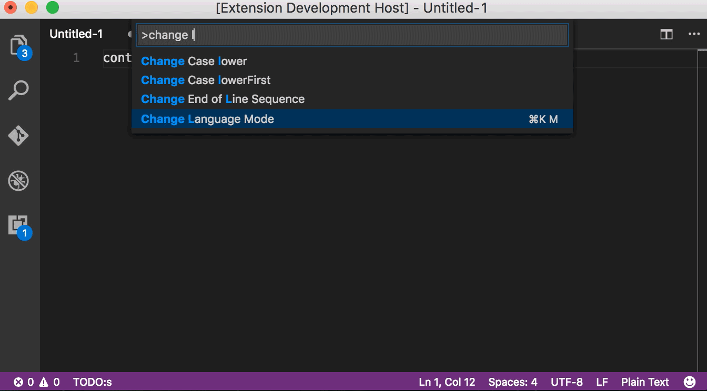

# Ruby


## About

[Ruby](https://www.ruby-lang.org/) is an interpreted, high-level, general-purpose programming language. It was designed and developed in the mid-1990s by Yukihiro “Matz” Matsumoto in Japan.

## Installation

Change `enable` from `False` to `True` in the `ruby` section \(cf [module installation](../install.md)\).

```yaml
vscode-anywhere:
    ruby:
        enabled: True
```


You can also take a look at the [VSCode-Anywhere ruby module configuration](https://github.com/gigi206/VSCode-Anywhere/blob/V2/salt/modules/ruby/defaults.yaml).


## Requirements

### Linux requirements

Solargraph is compiled with [brew](https://brew.sh) and brew needs the native **gcc** package installed on your Linux distribution. If you haven't the native **gcc** package installed, it will fail to compile.

## VSCode

### VSCode extensions

#### rebornix.Ruby

This [extension](https://marketplace.visualstudio.com/items?itemName=rebornix.Ruby) provides enhanced Ruby language and debugging support for Visual Studio Code.

#### castwide.solargraph

[Solargraph](https://marketplace.visualstudio.com/items?itemName=castwide.solargraph) is a language server that provides IntelliSense, code completion, and inline documentation for Ruby.


#### connorshea.vscode-ruby-test-adapter

This [extension](https://marketplace.visualstudio.com/items?itemName=connorshea.vscode-ruby-test-adapter) allows to run your Ruby tests.


#### kaiwood.endwise

This [extension](https://marketplace.visualstudio.com/items?itemName=kaiwood.endwise) allows to run your Ruby tests.


#### bung87.rails

This [extension](https://marketplace.visualstudio.com/items?itemName=bung87.rails) allows Ruby on Rails support in VSCode.




This extension will be installed only if `rails` is enabled.


#### shanehofstetter.rails-i18n

This [extension](https://marketplace.visualstudio.com/items?itemName=shanehofstetter.rails-i18n) is a Rails i18n helper.



This extension will be installed only if `rails` is enabled.


#### aki77.rails-routes

This [extension](https://marketplace.visualstudio.com/items?itemName=aki77.rails-routes) is a definition and completion provider for Rails Routes.



This extension will be installed only if `rails` is enabled.


#### jemmyw.rails-fast-nav

This [extension](https://marketplace.visualstudio.com/items?itemName=jemmyw.rails-fast-nav) allows Navigation in Rails.



This extension will be installed only if `rails` is enabled.


#### vortizhe.simple-ruby-erb

This [extension](https://marketplace.visualstudio.com/items?itemName=vortizhe.simple-ruby-erb) provides a simple Ruby and ERB language, code snippets and ERB tag helper support for Visual Studio Code without messing with linting or debugging.



This extension will be installed only if `rails` is enabled.


#### karunamurti.haml

This [extension](https://marketplace.visualstudio.com/items?itemName=karunamurti.haml) provides haml support, with parentheses coloring, auto-close parentheses, brackets, curly braces, quote, double quote, backtick, ruby interpolations, etc.



This extension will be installed only if `rails` is enabled.


#### aki77.haml-lint

This [extension](https://marketplace.visualstudio.com/items?itemName=aki77.haml-lint) provides a haml linter.


This extension will be installed only if `rails` is enabled.


### VSCode settings

#### Global settings

```javascript
{
  "ruby.lint": {
    "reek": true,
    "rubocop": false,
    "ruby": true,
    "fasterer": true,
    "debride": true,
    "ruby-lint": true
  },
  "ruby.codeCompletion": false,
  "ruby.format": false,
  "ruby.intellisense": false,
  "solargraph.autoformat": true,
  "solargraph.hover": true,
  "solargraph.completion": true,
  "solargraph.diagnostics": true,
  "solargraph.formatting": true
}
```

#### Windows settings

```javascript
{
  "ruby.interpreter.commandPath": "C:\\VSCode-Anywhere\\apps\\scoop\\apps\\ruby\\current\\bin\\gem.cmd",
  "solargraph.commandPath": "C:\\VSCode-Anywhere\\apps\\scoop\\apps\\ruby\\current\\gems\\bin\\solargraph.bat",
}
```


Assuming you have installed in the default directory `C:\VSCode-Anywhere`.


If `rails` is set to `True`:

```javascript
{
  "hamlLint.executablePath": "C:\\VSCode-Anywhere\\apps\\scoop\\apps\\ruby\\current\\gems\\bin\\haml-lint.bat"
}
```


Assuming you have installed in the default directory `C:\VSCode-Anywhere`.


#### Linux settings

```javascript
{
  "ruby.interpreter.commandPath": "/home/linuxbrew/.linuxbrew/bin/gem",
  "solargraph.commandPath": "/home/linuxbrew/.linuxbrew/bin/solargraph"
}
```

If `rails` is set to `True`:

```javascript
{
  "hamlLint.executablePath": "/home/linuxbrew/.linuxbrew/bin/haml-lint"
}
```

### VSCode keybindings

No [keybindings](https://code.visualstudio.com/docs/getstarted/keybindings).

## Software

### Windows software

#### scoop

* [ruby](https://github.com/ScoopInstaller/Main/blob/master/bucket/ruby.json)


The`ridk install 3`command will be executed after installing ruby.

`ridk` will install all dependencies for compiling ruby modules by installing some [msys2](../settings/global/msys2.md) packages.


### Linux software

#### brew

* [ruby](https://formulae.brew.sh/formula/ruby)
* [make](https://formulae.brew.sh/formula/make)
* [gcc](https://formulae.brew.sh/formula/gcc)

## Documentation

* [Ruby](https://github.com/Kapeli/feeds/blob/master/Ruby.xml)
* [Ruby\_2](https://github.com/hashhar/dash-contrib-docset-feeds/blob/master/Ruby_2.xml)

## VSCode-Anywhere

### Environment

#### Windows environment

```yaml
GEM_HOME: C:\VSCode-Anywhere\apps\scoop\apps\ruby\current\gems
GEM_PATH: C:\VSCode-Anywhere\apps\scoop\apps\ruby\current\gems
PATH: C:\VSCode-Anywhere\apps\scoop\apps\ruby\current\bin
```


Assuming you have installed in the default directory `C:\VSCode-Anywhere`.


#### Linux environment

```yaml
GEM_HOME: /home/myuser/VSCode-Anywhere/apps/vscode-anywhere/ruby
GET_PATH: /home/myuser/VSCode-Anywhere/apps/vscode-anywhere/ruby
PATH: /home/myuser/VSCode-Anywhere/apps/vscode-anywhere/ruby/bin
```


Assuming you have installed in the directory `/home/myuser/VSCode-Anywhere`.


### Specific settings

#### rails

Enable settings / modules for [ruby on rails](https://rubyonrails.org) \(`False` by default\).

```yaml
vscode-anywhere:
  enabled: True
  rails: True
```

#### gem

Allow installing [ruby gems](https://rubygems.org).


* **`pkgs`**: name of the packages to install
  * `enabled`: `True` to `enable`, `False` to skip \(default to `False`\)
  * `version`: the version of the gem package


* **`opts`**

`opts` is not mandatory but allows to pass additional arguments.

Extra args can be arguments described in the [Saltstack gem states](https://docs.saltstack.com/en/master/ref/states/all/salt.states.gem.html) or can be [global Saltstack arguments](https://docs.saltstack.com/en/latest/ref/states/requisites.html).


Global `opts` packages settings:

* `gem:pkgs:opts:global`: allow passing arguments **to all gem packages** when **installing**, **updating**, or **uninstalling** a package
*  `pm:pkgs:opts:install`: allow passing arguments **to all gem packages** when **installing** a package \(cf [states.gem.installed](https://docs.saltstack.com/en/master/ref/states/all/salt.states.gem.html#salt.states.gem.installed)\)
* `gem:pkgs:opts:update`: allow passing arguments **to all gem packages** when **updating** a package \(cf [states.gem.installed](https://docs.saltstack.com/en/master/ref/states/all/salt.states.gem.html#salt.states.gem.installed)\)
* `gem:pkgs:opts:uninstall`: allow passing arguments **to** `<mypkg>` **gem packages** when **uninstalling** the package \(cf [states.gem.removed](https://docs.saltstack.com/en/master/ref/states/all/salt.states.gem.html#salt.states.gem.removed)\)

#### 

Specific `opts` packages settings:

* `gem:pkgs:<mypkg>:opts:global`: allow passing arguments **to** `<mypkg>` **gem package** when **installing**, **updating**, or **uninstalling** the package
*  `gem:pkgs:<mypkg>:opts:install`: allow to pass arguments **to** `<mypkg>` **gem packages** when **installing** the package \(cf [states.gem.installed](https://docs.saltstack.com/en/master/ref/states/all/salt.states.gem.html#salt.states.gem.installed)\)
* `gem:pkgs:<mypkg>:opts:update`: allow to pass arguments **to** `<mypkg>` **gem packages** when **updating** the package \(cf [states.gem.installed](https://docs.saltstack.com/en/master/ref/states/all/salt.states.gem.html#salt.states.gem.installed)\)
* `gem:pkgs:<mypkg>:opts:uninstall`: allow to pass arguments **to** `<mypkg>` **gem packages** when **uninstalling** the package \(cf [states.gem.removed](https://docs.saltstack.com/en/master/ref/states/all/salt.states.gem.html#salt.states.gem.removed)\)


* global:

```yaml
vscode-anywhere:
  ruby:
    enabled: True
    gem:
      opts:
        global: {}
        install:
          rdoc: True
          ri: True
        update:
          rdoc: True
          ri: True
        uninstall: {}
      pkgs:
        asdf:
          enabled: True
          opts:
            install: {}
            update: {}
            uninstall: {}
        minitest:
          enabled: True
          opts:
            install: {}
            update: {}
            uninstall: {}
        rubyfmt:
          enabled: True
          opts:
            install: {}
            update: {}
            uninstall: {}
        rufo:
          enabled: True
          opts:
            install: {}
            update: {}
            uninstall: {}
        rspec:
          enabled: True
          opts:
            install: {}
            update: {}
            uninstall: {}
        rspec-core:
          enabled: True
          opts:
            install: {}
            update: {}
            uninstall: {}
        rvm:
          enabled: True
          opts:
            install: {}
            update: {}
            uninstall: {}
        standard:
          enabled: True
          opts:
            install: {}
            update: {}
            uninstall: {}
        yard:
          enabled: True
          opts:
            install: {}
            update: {}
            uninstall: {}
        rdoc:
          enabled: True
          opts:
            install: {}
            update: {}
            uninstall: {}
        fastri:
          enabled: True
          opts:
            install: {}
            update: {}
            uninstall: {}
        pkg-config:
          enabled: True
          opts:
            install: {}
            update: {}
            uninstall: {}
        nokogiri:
          enabled: True
          opts:
            install: {}
            update: {}
            uninstall: {}
        rubygems-update:
          enabled: True
          opts:
            install: {}
            update: {}
            uninstall: {}
        ruby-debug-ide:
          enabled: True
          opts:
            install: {}
            update: {}
            uninstall: {}
        debase:
          enabled: True
          opts:
            install: {}
            update: {}
            uninstall: {}
        rcodetools:
          enabled: True
          opts:
            install: {}
            update: {}
            uninstall: {}
        reek:
          enabled: True
          opts:
            install: {}
            update: {}
            uninstall: {}
        fasterer:
          enabled: True
          opts:
            install: {}
            update: {}
            uninstall: {}
        debride:
          enabled: True
          opts:
            install: {}
            update: {}
            uninstall: {}
        ruby-lint:
          enabled: True
          opts:
            install: {}
            update: {}
            uninstall: {}
        solargraph:
          enabled: True
          opts:
            install: {}
            update: {}
            uninstall: {}

```

If `rails` is set to `True`, the following gems will be added:

```yaml
vscode-anywhere:
  ruby:
    enabled: True
    gem:
      pkgs:
        rails:
          enabled: True
          opts:
            install: {}
            update: {}
            uninstall: {}
        haml_lint:
          enabled: True
          opts:
            install: {}
            update: {}
            uninstall: {}
```

* * Windows:

```yaml
vscode-anywhere:
  ruby:
    enabled: True
    gem:
      opts:
        global:
          gem_bin: C:\VSCode-Anywhere\apps\scoop\apps\ruby\current\bin\gem.cmd
```


Assuming you have installed in the default directory `C:\VSCode-Anywhere`.


* Linux:

```yaml
vscode-anywhere:
  ruby:
    enabled: True
    gem:
      opts:
        global:
          gem_bin: /home/linuxbrew/.linuxbrew/bin/gem
```

